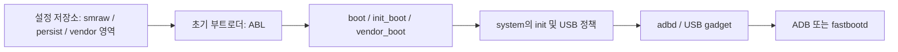

# Qualcomm Android 기기: EDL 기반 디버그 모드 활성화와 GSI 설치 가이드

대상: Qualcomm SoC, EDL(9008), A/B 슬롯, dynamic partition(`super`)을 사용하는 Android 기기  
목적: 순정에서 디버그 정책을 분석·변경하고 EDL을 통해 fastbootd로 진입하여 GSI `system.img`를 설치하는 일반 절차

> 이 문서는 작업 방법과 검증 기준을 설명한다. 다른 기기의 ABL, `init`, `vbmeta`, `smraw` 파일이나 섹터 주소를 그대로 재사용하면 안 된다. 모든 바이너리·해시·LUN·파티션 위치는 **대상 기기에서 다시 추출하고 검증**해야 한다.

## 포터블 실행 도구 폴더

이 가이드와 함께 제공되는 [portable-qualcomm-edl-gsi](portable-qualcomm-edl-gsi) 폴더는 다른 PC로 그대로 복사해 쓸 수 있다. 모든 실행 파일은 자신의 위치를 기준으로 경로를 계산하므로 개인 PC의 사용자 폴더 경로를 포함하지 않는다.

```text
portable-qualcomm-edl-gsi/
├─ run/                         # 번호 순서대로 실행하는 CMD 파일
├─ scripts/                     # PowerShell 구현부
├─ tools/
│  ├─ edl/                      # edl.py와 edlclient 폴더를 넣는다
│  │  ├─ edl.py
│  │  └─ firehose.elf           # 대상 기기에 맞는 Firehose programmer
│  └─ platform-tools/           # Google platform-tools 전체를 넣는다
│     └─ fastboot.exe
├─ inputs/
│  ├─ gsi/system.img            # 설치할 GSI
│  └─ patches/                  # 대상 기기에서 검증한 패치 파일과 JSON 계획
├─ backups/                     # 실행 중 자동 생성: 읽기 전 백업과 EDL 덤프
└─ logs/                        # 실행 중 자동 생성: 명령 로그
```

### 파일 배치

1. `tools/edl/`에 bkerler EDL 도구 전체(`edl.py`, `edlclient` 폴더)와 **대상 기기에 맞는** `firehose.elf`를 넣는다.
2. `tools/platform-tools/`에 Google Android platform-tools 압축을 풀어 `fastboot.exe`와 DLL을 넣는다.
3. `inputs/gsi/system.img`에 설치할 GSI를 둔다.
4. `inputs/patches/`에 해당 기기에서 추출·검증한 원본/수정 바이너리와 JSON 계획 파일을 둔다.
5. 대상 기기 전체 LUN/GPT 백업은 이 폴더 밖의 안전한 저장소에도 보관한다.

### 단일 CMD 메뉴와 실행 순서

`portable-qualcomm-edl-gsi/RUN_TOOLKIT.cmd`를 실행한다. 메뉴에서 키보드 `1~7` 또는 `Q`를 눌러 선택한다.

| 키 | 메뉴 | 작업 |
| --- | --- | --- |
| `1` | EDL INFO | EDL 연결과 GPT 확인 |
| `2` | PATCH PREFLIGHT | 패치 대상의 라이브 원본 해시만 확인 |
| `3` | APPLY PATCHES | 기기별 `init`/ABL/AVB 패치 적용 및 읽기 검증 |
| `4` | SET DEBUG FLAGS | 설정 저장소의 디버그 플래그 적용 및 읽기 검증 |
| `5` | BOOT FASTBOOTD | BCB로 fastbootd 요청 후 EDL 리셋 |
| `6` | FLASH GSI | GSI logical partition 정리·플래시·선택적 wipe |
| `7` | RESTORE PATCHES | 패치 계획 범위만 원복 |
| `Q` | Quit | 메뉴 종료 |

실행 흐름은 `1 → 2 → 3 → 4 → 5 → 6`이다. 개별 실행이 필요할 때는 기존 `run` 폴더의 번호별 CMD 파일도 사용할 수 있다.

### JSON 계획 파일

| 파일 | 역할 |
| --- | --- |
| `inputs/patches/patch-plan.json` | `init`, ABL, `vbmeta` 등 기기별 바이너리 패치의 LUN·섹터·원본/수정 파일·SHA-256 정의 |
| `inputs/patches/debug-flags.json` | 디버그 설정 저장소 블록과 바이트 필드 정의. `smraw`는 한 사례일 뿐이다. |
| `inputs/patches/bcb.json` | `misc` 안 BCB의 위치와 명령 필드 정의 |
| `inputs/gsi/gsi-plan.json` | 삭제할 logical partition, GSI 대상 파티션, wipe 여부 정의 |

템플릿 JSON은 기본적으로 비활성화돼 있다. 대상 기기의 GPT·블록 크기·원본 SHA-256을 채우기 전에는 쓰기 단계가 실행되지 않는다. 공용 스크립트는 쓰기 전 원본 해시와 쓰기 후 읽기 해시를 모두 확인하며, 백업과 로그를 남긴다.

## 구조를 먼저 이해하기

최신 상용 Android 기기에서는 디버그 플래그 하나를 바꿔도 실제 ADB 또는 디버그 모드가 켜지지 않을 수 있다. 값이 여러 단계에서 다시 차단되기 때문이다.



확인해야 할 것은 다음 네 가지다.

1. 디버그 설정값이 저장되는 위치
2. ABL이 그 값을 무시하거나 강제로 꺼버리는지
3. Android `init` 또는 vendor USB 정책이 다시 꺼버리는지
4. 수정한 이미지가 AVB 검증 체인에서 허용되는지

## 1. 대상 기기 식별 및 전체 백업

### EDL 연결 확인

기기를 EDL(일반적으로 Qualcomm 9008)로 진입시킨다. EDL 도구가 해당 기기의 맞는 Firehose programmer로 GPT와 UFS/eMMC 정보를 읽을 수 있어야 한다.

확인할 항목:

- USB VID/PID 및 기기 시리얼
- 저장장치 유형: UFS 또는 eMMC
- LUN 수와 블록 크기
- 각 LUN의 GPT
- 활성 A/B 슬롯 및 UFS boot LUN

### 전체 백업은 필수

롬 설치 전 대상 기기의 저장장치 전체를 백업한다. 백업에는 GPT를 포함한 모든 LUN이 들어가야 한다.

특히 다른 기기에서 복제하면 안 되는 영역:

- `persist`
- modem/NV(`modemst`, `fsg` 등)
- 보안·키·식별 관련 파티션
- `userdata`

복구 가능 여부는 “몇 개 파티션을 백업했는가”보다, 원본 GPT와 모든 LUN을 일관되게 복원할 수 있는가로 판단한다.

## 2. A/B 슬롯과 dynamic partition 조사

EDL에서 GPT를 읽은 뒤 다음을 표로 기록한다.

| 항목 | 확인 내용 |
| --- | --- |
| 활성 슬롯 | `a` 또는 `b` |
| 부트 체인 | `xbl`, `abl`, `boot`, `vendor_boot`, `init_boot`, `dtbo`, `vbmeta`의 슬롯별 위치 |
| 동적 파티션 | `super` 위치와 크기 |
| logical partition | `system`, `system_ext`, `product`, `vendor`, `odm` 등의 슬롯별 크기 |
| 메타데이터 | `metadata`, `misc` 위치 |
| 검증 체인 | `vbmeta`, `vbmeta_system`의 슬롯별 상태 |

`system_a`와 `system_b`의 크기 또는 내용이 같다고 가정하지 않는다. 활성 슬롯만 바꾸거나 도너 기기 데이터를 전체 복제하는 방식은 부팅 체인과 기기 고유 데이터를 망가뜨릴 수 있다.

## 3. 디버그 차단 위치 분석

### 설정 저장소 찾기

제조사별로 디버그 설정은 `smraw`, `persist`, vendor 파티션, NVRAM 또는 일반 파일에 저장될 수 있다.

1. 구버전과 신버전의 설정 저장소를 비교한다.
2. 디버그 ON/OFF 전후의 블록 차이를 기록한다.
3. 문자열 또는 구조체 필드가 실제로 바뀌는지 확인한다.
4. 수정 뒤 부팅 시 원래 값으로 되돌아가는지 확인한다.

저장값이 `true`인데도 기능이 켜지지 않으면, 이후 부트 단계가 값을 무시하거나 재설정하는 것이다.

### ABL 분석

최신 펌웨어의 ABL과 이전 정상 버전의 ABL을 비교한다.

- 설정 문자열 또는 관련 함수 참조점 탐색
- 값 읽기 직후 `false`를 쓰는 분기 탐색
- 슬롯 A/B의 ABL 차이 확인
- 바이트 패치 대신 이전 서명된 호환 ABL을 쓸 수 있는지 확인

ABL을 수정할 때는 해당 슬롯의 원본 전체를 별도 보관하고, 대상 기기·대상 빌드에서 추출한 해시와 일치할 때만 쓰기를 허용한다.

### `init`과 USB 정책 분석

`system`, `vendor_boot`, `init_boot`, vendor RC 파일에서 다음을 조사한다.

- 디버그 값을 `false`로 되돌리는 코드
- `ro.debuggable`, `persist.sys.usb.config`, `sys.usb.config` 관련 정책
- `adbd` 시작 조건
- USB 역할(host/device), Type-C role, 서비스 포트 전용 정책
- SELinux 정책과 `adbd` transport 생성 실패

실행 바이너리를 변경하는 경우, 변경된 `system`에 맞는 AVB 메타데이터까지 함께 설계해야 한다.

## 4. AVB 검증 체인 유지

`system`, `vendor_boot`, `init_boot` 같은 검증 대상 이미지를 수정하면 기존 `vbmeta` 또는 `vbmeta_system`이 부팅을 막을 수 있다.

다음 중 대상 기기에 맞는 경로를 선택한다.

1. OEM이 허용하는 공식 언락 후 사용자 정의 AVB 키/메타데이터 사용
2. 대상 기기에서 이미 검증된, 수정 이미지와 대응하는 서명된 메타데이터 사용
3. 순정에 포함된 다른 슬롯 또는 이전 버전의 정합된 이미지 집합 사용

서로 다른 빌드의 `system`과 `vbmeta`를 임의로 조합하지 않는다. 부팅 실패의 대표 원인이다.

## 5. 패치 적용의 안전한 순서

패치 도구는 다음 성질을 가져야 한다.

- 대상 USB 시리얼 또는 기기 식별값 확인
- 쓰기 전 모든 대상 블록의 원본 SHA-256 확인
- 쓰기 후 독립적인 재읽기와 SHA-256 확인
- 중간 실패 시 완료·미완료 범위 기록
- 재부팅·슬롯 변경·`userdata` 삭제를 자동으로 하지 않음

권장 순서:

1. 모든 대상 블록을 읽고 원본 해시 검증
2. OS 이미지 변경
3. 변경된 OS와 짝인 AVB 메타데이터 기록·검증
4. ABL 또는 초기 부트 단계 변경·검증
5. 설정 저장소의 디버그 값 변경·검증
6. 부팅 전 각 영역을 다시 읽어 최종 해시 확인

중간에 EDL 연결이 끊겼다면 같은 데이터를 무작정 다시 쓰지 않는다. 먼저 라이브 저장소를 읽어 실제 기록 여부를 해시로 판단한다.

## 6. EDL에서 fastbootd로 진입

ADB가 막혔거나 OS가 부팅하지 않아도, 많은 Android 기기는 `misc`의 BCB(Bootloader Control Block)를 통해 다음 부팅 모드를 요청할 수 있다.

```text
boot-fastboot
```

일반 흐름:

1. EDL에서 `misc`의 BCB 블록을 읽어 원본으로 보관
2. 나머지 BCB 데이터를 보존한 채 부팅 명령을 `boot-fastboot`로 변경
3. 변경 블록을 다시 읽어 검증
4. Firehose reset 수행
5. PC에서 `fastboot devices` 및 `fastboot getvar is-userspace` 확인

`is-userspace: yes`여야 dynamic partition을 다루는 fastbootd다. 일반 bootloader fastboot와 혼동하지 않는다.

부팅 요청 후에는 BCB가 남아 있으면 계속 fastbootd로 재부팅될 수 있다. 설치가 끝나거나 복구할 때는 원본 BCB를 복원하거나 명령 필드를 비워 둔다.

## 7. GSI 설치 전 용량 설계

GSI의 `system.img` 크기와 현재 `system_<slot>` logical partition 크기를 먼저 비교한다.

```text
GSI system.img 크기 <= 설치 뒤 system_<slot> 크기
```

GSI가 더 크면 같은 dynamic partition group 안의 `product`, `system_ext`, `odm` 등에서 공간을 확보해야 할 수 있다.

삭제 후보는 기기와 GSI에 따라 다르다. 순정 파티션을 지우기 전 아래를 확인한다.

- GSI가 해당 파티션을 실제로 필요로 하는가
- 다른 슬롯의 같은 파티션을 보존할 수 있는가
- 설치 실패 시 `super` 및 logical partition metadata를 복구할 수 있는가
- 현재 활성 슬롯과 설치 대상 슬롯이 일치하는가

처음부터 `system_a`와 `system_b`를 삭제하지 않는다. 대용량 전송이 끊길 경우 두 슬롯 모두 부팅 불능이 된다.

## 8. fastbootd에서 GSI 설치

기기별 파티션 설계가 확정된 후의 일반적 순서는 다음과 같다.

```powershell
# 연결과 모드 확인
fastboot devices
fastboot getvar is-userspace
fastboot getvar current-slot

# 필요한 logical partition만 정리 또는 삭제
fastboot delete-logical-partition <partition_name>

# GSI 기록
fastboot flash system <path-to-system.img>

# 필요한 경우 사용자 데이터 초기화
fastboot -w

# 부팅
fastboot reboot
```

`fastboot -w`는 잠긴 기기에서 `userdata` 삭제가 거부될 수 있다. 이 경우 `-w`가 실패했다는 사실과 `system` 플래시 가능 여부는 별개로 판단한다. 잠금 상태의 쓰기 정책은 OEM과 fastbootd 구현마다 다르다.

일반적인 GSI는 잠긴 AVB 체인에서 부팅이 거부될 수 있다. fastboot가 전송을 허용해도 부팅 성공을 보장하지 않는다. 공식 부트로더 언락이 가능한 기기는 그 경로를 우선 검토한다.

## 9. USB 전송이 중간에 끊길 때

fastbootd 대용량 전송에서만 끊기면, 디버그 패치가 원인인지와 물리·드라이버 문제가 원인인지를 분리한다.

1. 순정 상태에서도 `fastboot devices`/`getvar`가 반복해서 안정적인지 확인
2. PC 후면 포트, 짧은 데이터 케이블, 허브 없는 연결로 교차 검증
3. 다른 PC와 다른 platform-tools 버전으로 재현성 확인
4. USB 절전·선택적 절전 해제
5. GSI 파일의 SHA-256 확인
6. 전송 실패 뒤 EDL 복구 경로가 여전히 작동하는지 확인

작은 제어 명령은 안정적이고 수백 MB 전송부터만 끊긴다면, 우선 전원·케이블·드라이버·host controller·전송 단위 문제를 의심한다.

## 10. 복구 절차

부팅 루프, 로고 반복, fastbootd 고정, AVB 오류가 나면 다음 순서로 복구한다.

1. EDL 재진입
2. 대상 기기에서 만든 전체 백업과 GPT를 비교
3. 수정한 파티션만 원본으로 복구하고 읽기 검증
4. AVB 메타데이터와 OS 이미지가 같은 복구 시점인지 확인
5. `misc` BCB를 원본으로 복원
6. UFS boot LUN 및 활성 슬롯 관련 상태 확인
7. 필요하면 전체 LUN 백업본을 비교 복원

도너 기기의 전체 저장소 덤프는 최후의 참고 자료로만 사용한다. 대상 기기 복구본을 대체하지 않는다.

## 체크리스트

- [ ] 대상 기기 전체 EDL 백업과 GPT 백업 보유
- [ ] 활성 슬롯, boot LUN, dynamic partition 구성을 기록
- [ ] 디버그 차단이 저장소·ABL·`init` 중 어디에 있는지 분석
- [ ] 패치 전·후 해시 및 롤백 파일 보관
- [ ] 수정 이미지와 AVB 메타데이터의 정합성 확인
- [ ] fastbootd `is-userspace: yes` 확인
- [ ] GSI 크기와 logical partition group 용량 계산
- [ ] USB 대용량 전송 안정성 확인
- [ ] 실패 시 EDL 복구 절차 준비
